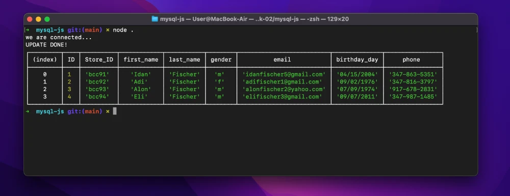

# MySQL with JavaScript 

Week 2, Day 2. connecting mySQL with JavaScript using Node.

## Lesson Learned
1. Node
2. NPM
3. MySQL
4. Secrets

To see the repo [click here](https://github.com/IdanFischer/mysql-js).

